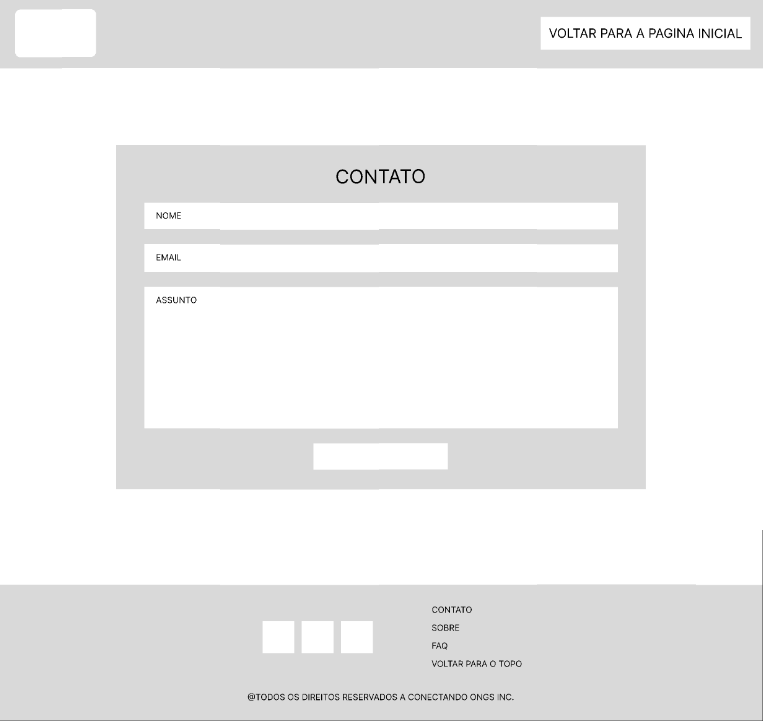

# Documentação do Projeto - Trabalho Interdisciplinar 1

`Tema`
- Conectar ONGs

`CURSO` 

 - Ciência da computação

## Estrutura
- [Documentação do Projeto - Trabalho Interdisciplinar 1](#documentação-do-projeto---trabalho-interdisciplinar-1)
  - [Estrutura](#estrutura)
  - [Participantes](#participantes)
  - [Problema](#problema)
  - [Objetivos](#objetivos)
  - [Justificativa](#justificativa)
  - [Público-alvo](#público-alvo)
  - [Persona](#persona)
  - [Histórias de Usuários](#histórias-de-usuários)
  - [Requisitos](#requisitos)
    - [Requisitos Funcionais](#requisitos-funcionais)
    - [Requisitos não Funcionais](#requisitos-não-funcionais)
  - [Wireframe](#wireframe)
  - [Ferramentas](#ferramentas)
  

## Participantes
 Os membros do grupo são:
 - Amanda Lima Medeiros
 - Ary Gomes da Costa
 - Davi Thomáz Edmudo
 - Gabriel Mello Ribeiro da Silva
 - Matheus Magalhães Rossi
 - Rondinelly Martins Silva
 - Victor BaroniVictor Baroni

## Problema
Vimos ONGs trabalhando incansavelmente em suas comunidades, mas muitas vezes operando isoladamente, sem conexão com outras organizações que compartilham objetivos semelhantes. Testemunhamos também indivíduos de coração generoso, desejando contribuir de forma significativa, mas sem saber por onde começar ou como encontrar causas alinhadas com suas paixões e valores. 

## Objetivos
 - Criar um espaço online onde ONGs podem se unir, compartilhar recursos e experiências, e encontrar parceiros para amplificar seu impacto.
 - Aproximar aqueles que desejam doar com as causas que mais precisam de apoio
 - Fornecer um espaço virtual para pessoas que precisam de ajuda se informarem do passo a passo fazerem parte dos projetos.

## Justificativa
A criação de uma plataforma de conexão entre ONGs se justifica pela necessidade de superar as barreiras existentes na captação de recursos e na colaboração entre as organizações sociais. Ao facilitar o acesso a informações e oportunidades de parceria, podemos fazer com que os recursos sejam destinados a um maior número de pessoas, mais colaboradores se juntem à causa e também fazer com que a iniciativa de doação alcance cada vez mais pessoas. Além disso, a transparência das ONGs com o que será feito com o recurso é um dos principais fatores que impede o aumento da quantidade de doares, bem como da quantidade doada ao projeto, e a confiança gerada pela plataforma podem contribuir para uma maior eficiência na utilização dos recursos disponíveis.

## Público-alvo
- Potenciais doadores e financiadores interessados
- Donatários
- ONGs de diferentes áreas de atuação, que buscam parceiros, doadores e voluntários para apoiar suas iniciativas.
- Empresas filantrópicas
## Persona
Exemplo de personas que identificamos na nossa pesquisa:
- Joana Almeida

- Maria Lúcia 

## Histórias de Usuários

Com base na análise das personas forma identificadas as seguintes histórias de usuários:

|EU COMO... `PERSONA`| QUERO/PRECISO ... `FUNCIONALIDADE` |PARA ... `MOTIVO/VALOR`                 |
|--------------------|------------------------------------|----------------------------------------|
|Maria Luiza       | Encontrar ONGs que precisam de voluntários | Contribuir com causas sociais e me engajar em atividades de voluntariado |
|Lucas      | Fazer doações para ONGs que apoiam causas que me interessam | Contribuir financeiramente para iniciativas alinhadas com meus valores |
|Maria Luiza        | Oferecer recursos e expertise para ONGs que precisam de apoio técnico | Contribuir com meu conhecimento e experiência para o sucesso de projetos sociais |
|Joana    | Encontrar parceiros e colaboradores para um projeto específico | Formar uma equipe qualificada e engajada para desenvolver um projeto social |
|Joana   | Promover um evento de arrecadação de fundos para uma causa específica | Mobilizar recursos e apoio para uma iniciativa de impacto social |

## Requisitos

### Requisitos Funcionais

|ID    | Descrição do Requisito  | Prioridade |
|------|-----------------------------------------|----|
|RF-001| A plataforma deve permitir que as ONGs cadastrem seus perfis, incluindo informações sobre suas atividades, projetos e necessidades | ALTA | 
|RF-002| A plataforma deve permitir que os usuários busquem ONGs com base em critérios específicos, como área de atuação, localização e necessidades | ALTA |
|RF-003| A plataforma deve permitir que os usuários entrem em contato com as ONGs diretamente através da plataforma, para oferecer apoio, doações ou voluntariado | ALTA |
|RF-004| A plataforma deve permitir que as ONGs criem projetos e iniciativas específicas, solicitando apoio e recursos da comunidade | ALTA |
|RF-005| A plataforma deve fornecer ferramentas de comunicação e colaboração para facilitar o trabalho em equipe e a troca de informações entre as ONGs e seus parceiros | MÉDIA |

### Requisitos não Funcionais

|ID     | Descrição do Requisito  |Prioridade |
|-------|-------------------------|----|
|RNF-001| A plataforma deve ser responsiva e compatível com dispositivos móveis, para garantir uma experiência de uso consistente em diferentes dispositivos e tamanhos de tela | ALTA | 
|RNF-002| A plataforma deve ser segura e protegida contra ameaças de segurança, como ataques de hackers e vazamento de dados pessoais | ALTA | 
|RNF-003| A plataforma deve ser escalável e capaz de lidar com um grande volume de usuários e atividades, sem comprometer o desempenho ou a disponibilidade do sistema | ALTA | 
|RNF-004| A plataforma deve ser de fácil navegação e utilização, com uma interface intuitiva e amigável para usuários de diferentes níveis de habilidade e experiência | ALTA | 
|RNF-005| A plataforma deve ser acessível para pessoas com deficiência, seguindo as diretrizes de acessibilidade da Web e garantindo que todos os usuários possam utilizar o sistema de forma eficaz | ALTA |

## Wireframe
O wireframe utilizado foi o [Figma](https://www.figma.com/), onde foi desenhado a interface do usuário e desenvolvido o user flow.

- Home page
  

- Contato
  

- FAQ
  

## Ferramentas

