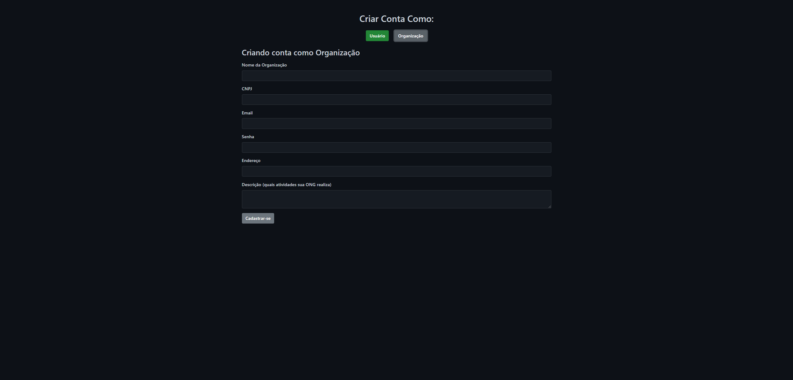

# grupo /conectando-ongs-1
- ary gomes da costa

## problema 
ONGs de pequeno porte enfrentam dificuldades para conseguir doações devido à falta de visibilidade. Isso ocorre, pois não conseguem se promover adequadamente, seja por falta de recursos para campanhas de anúncios em redes sociais ou por anúncios não direcionados ao público mais propenso a se interessar.

## Objetivos
Disponibilizar para ONGs pequenas/novas uma forma simples de encontrar possíveis doadores através de um website, que permite publicar campanhas beneficentes e coletar dados de pessoas interessadas. 

## Público-alvo
- ORGANIZAÇÕES NÃO GOVERNAMENTAIS DE PEQUENO PORTE
João, 31 anos, Fundador e Diretor de uma ONG de Resgate de Animais de Rua, um apaixonado por animais desde a infância, tem o objetivo de aumentar a taxa de adoção dos animais resgatados.

- PESSOAS QUE SENTEM A DOR DOS OUTROS
Maria, 21 anos, Estudante de Serviço Social, uma estudante universitária dedicada que sempre teve um forte senso de justiça social e desejo de ajudar os outros, quer fazer doações regulares, mesmo que pequenas, para ONGs e projetos que ela acredita.

## Justificativa
Eu acho importante abordar esse tema, pois várias ONGs com boas intenções não conseguem a visibilidade que merecem, muitas vezes sendo pela falta de capital para marketing direcionado.

## Requisitos
- cadastro de usuário
- cadastro organização
    - cadastro de campanha
    - remoção de campanha
- inscrever-se em uma campanha
- apresentação de 3 últimas campanhas registradas (mostrado no carrossel presente na landing-page/index.html)
- navbar personalizada dependendo do tipo de usuário
- manter sessão
- filtrar campanhas pelas tags (mostrado na página ap-campaign.html)
- filtrar organizações por nome (mostrado na página ap-ongs.html)
- apresentação de ongs
- apresentação de campanhas
- conversão de imagem.png, .jpg para base64.
- apresentação de usuários inscritos (caso seja ong e tenha campanhas ativa, se usuário se inscrever ele vai aparecer em subscribed-users.html)

## projeto de interface/wireframes/protótipo

## tecnologias
- HTML
- CSS
- BOOTSTRAP
- JAVASCRIPT
- JSON-SERVER
- .JSON

## processo
Fiquei sozinho, quando tinha tempo fazia um pouco do trabalho.

## atribuições
ary - fullstack ?

## ferramentas
- Visual Studio Code
- Live Server (VSCode extension)
- excalidraw

## funcionalidades de software
Com um layout simples, e botões chamativos, o usuário consegue facilmente navegar pelo site, podendo criar 2 tipos de conta, uma sendo de usuário comum a qual ele pode inscrever-se em campanhas, e o outro sendo a de organização onde se pode criar campanhas e excluí-las. Ambos têm acesso a uma barra de navegação que os leva para as páginas ong cadastradas e campanhas cadastradas, porém os usuários de tipo ong, tem acesso a criação de campanhas, ver os usuários inscritos em campanhas que os mesmos criaram e uma página para remoção das mesmas.

